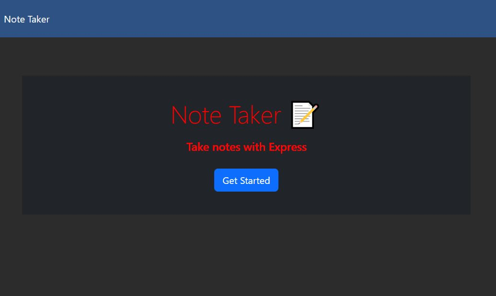
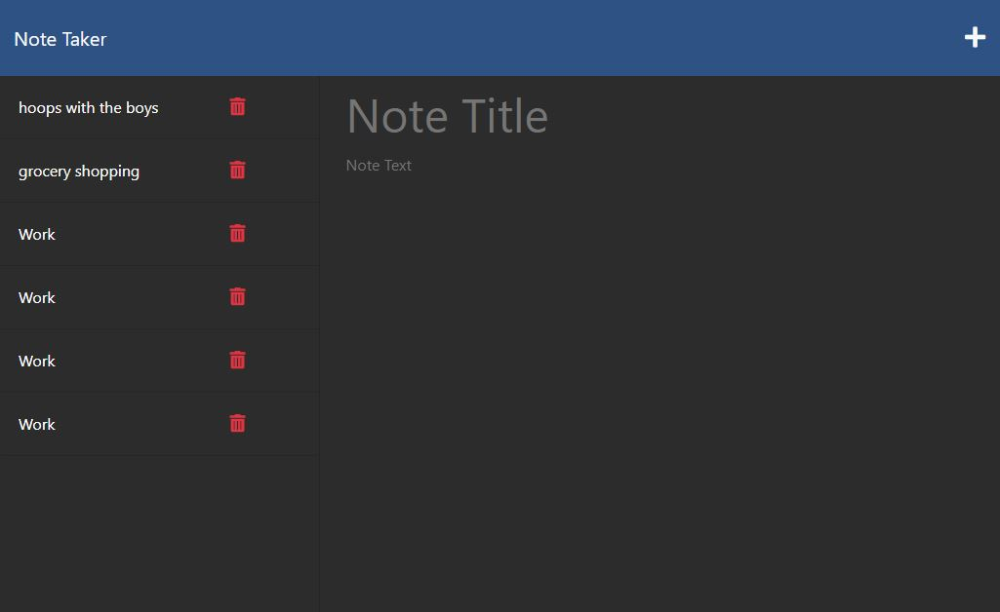
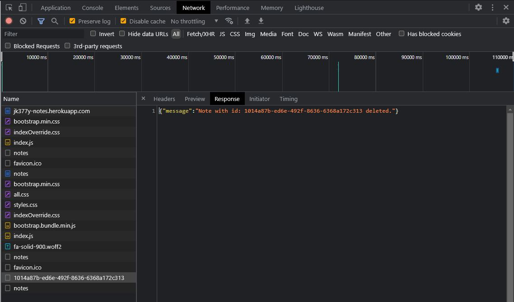

# JOT IT DOWN NOTE TAKER APP
Your challenge is to create an application called Note Taker that can be used to write and save notes. This application will use an Express.js back end and will save and retrieve note data from a JSON file. The application’s front end has already been created. It's your job to build the back end, connect the two, and then deploy the entire application to Heroku.
 
## Description
This is a note taking app that can accept inputs inside the web browser and store them to be recalled at a later time from the db.json file.  There is also functionality added to delete these notes.
 
## Table of Contents
- [Installation](#installation)
- [Usage](#usage)
- [Questions](#questions)
- [Contributing](#contributing)
- [License](#license)
 
## Installation
You must have node.js installed on your system.
You can run [npm i] to install all the required npm packages.
You must have imported all the necessary modules and packages:
     &emsp;1) Express npm package
     &emsp;2) UUID npm package
     &emsp;3) FS node module
     &emsp;4) PATH node module
 

## Usage
The application can be viewed and test at the link below.
 https://jk377y-notes.herokuapp.com/
 The code can be viewed on Github:
 https://github.com/jk377y/Jot-It-Down-Note-Taker
 

Screenshot of the deployed index.html page
 

 

Screenshot of the deployed notes.html page
 

 

Screenshot of the response given when a note is deleted from the notes.html page
 

 

## Questions
For Questions, I can be reached at the following:
 GitHub:  https://github.com/jk377y
 OR
 Email:  jk377y@gmail.com

## Contributing
NPM - npmjs.com (for research and documentation referencing)
 
Heroku - Heroku.com for documentation and providing deployment services
 
You also can help support me by donating with 💵Cash App💵 @ 💵$JK377Y💵
 

## License

 Copyright (c) 2023 James Kelly
 Information on this license can be found at: (https://opensource.org/licenses/MIT)

